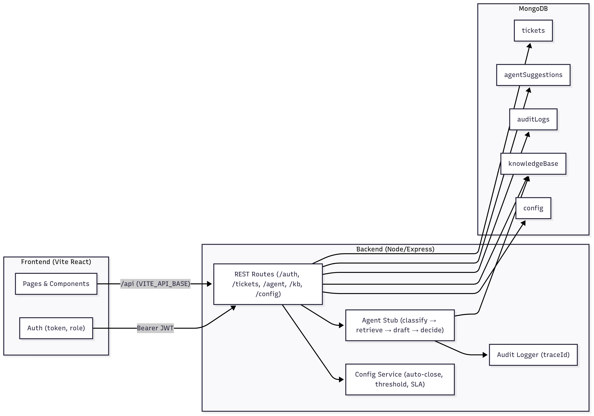

# 🤖 Smart Helpdesk with AI-Inspired Triage

A full-stack **AI-powered helpdesk system** that simulates how real-world support platforms integrate machine learning for ticket triage and knowledge retrieval.  

Built with:
- **Frontend**: React (Vite, TailwindCSS, Protected Routes)
- **Backend**: Node.js + Express
- **Database**: MongoDB
- **DevOps**: Docker + Docker Compose
- **Testing**: Jest (backend), Vitest + React Testing Library (frontend)

---

## 🌟 Key Features

### 🧑‍💻 Role-Based Access
- **End User** → Create tickets, view status, reply  
- **Support Agent** → Review AI suggestions, edit/send replies, close tickets  
- **Admin** → Manage Knowledge Base (KB), configure SLA, set auto-close thresholds  

### 🤖 AI-Inspired Triage Workflow
- **Classification** → Predicts ticket category (billing, tech, shipping, etc.)  
- **Retrieval** → Fetches top 3 relevant KB articles (RAG-style)  
- **Drafting** → Suggests a draft reply referencing KB  
- **Decision** → Confidence-based auto-close (≥ threshold) or escalate to human agent  
- **Audit Logging** → Every step logged with trace IDs for transparency  

### 📚 Knowledge Base
- Searchable KB with `/api/kb?query=...`  
- Batch hydrate `/api/kb/batch`  
- Individual article detail `/api/kb/:id`  
- Linked “Similar Articles” on each ticket detail page  

### ⚙️ Configurable Admin Settings
- SLA time (default 24h)  
- Auto-close enable/disable  
- Confidence threshold (numeric, inclusive ≥ check)  

### 🚀 DevOps & Testing
- One-command startup via `docker compose up`  
- Separate Dockerfiles for client & server  
- Backend: **5 tests** (auth, tickets, KB, triage decision, audit)  
- Frontend: **3 tests** (login, ticket creation, ticket detail with KB)  

---

## 🧠 Why this project is AI/ML relevant
Even though the current triage logic uses a rule-based stub, the system is architected to easily plug in real ML/NLP models. This makes it a great showcase of **AI system design**, not just CRUD:

- **Agentic Workflow** → mirrors LLM agent pipelines (plan → retrieve → act → decide).  
- **Confidence Thresholding** → common in ML decision systems.  
- **Retrieval-Augmented Generation (RAG)** → KB article lookup before drafting replies.  
- **Explainability** → traceable audit logs for each AI-driven step.  

Future extension: swap the stub with a classifier (e.g., scikit-learn, HuggingFace, or OpenAI API) to make it a real AI-driven support system.

---

## 📂 Project Architecture

